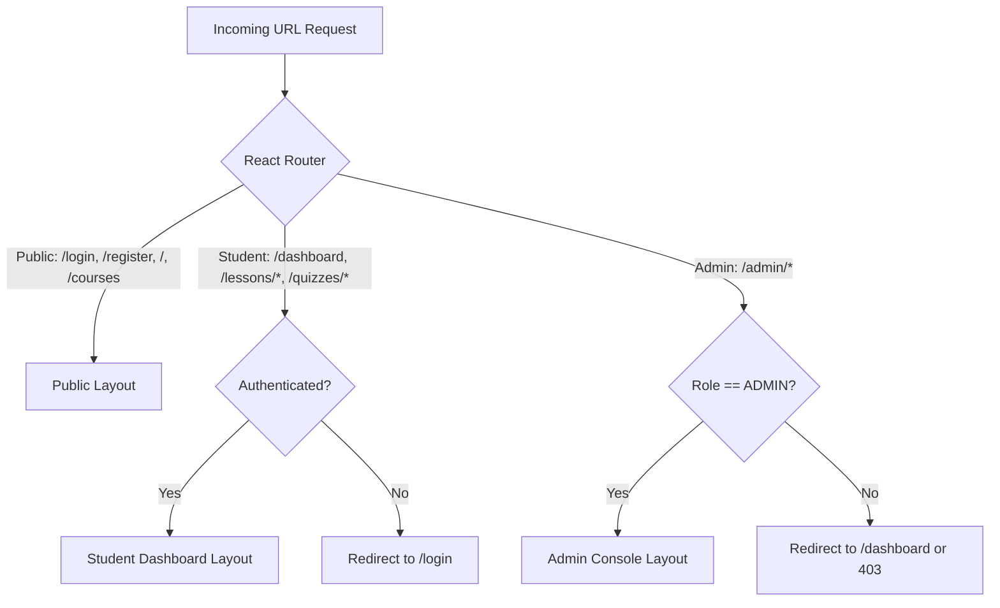
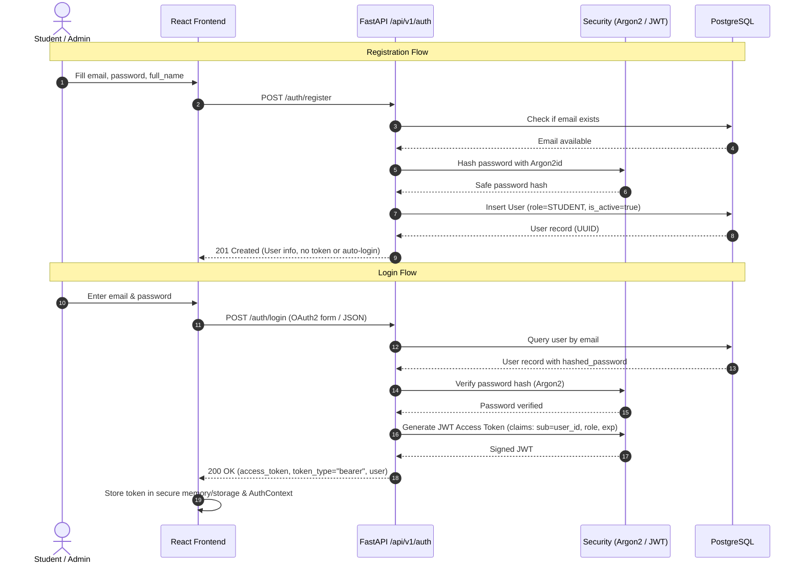
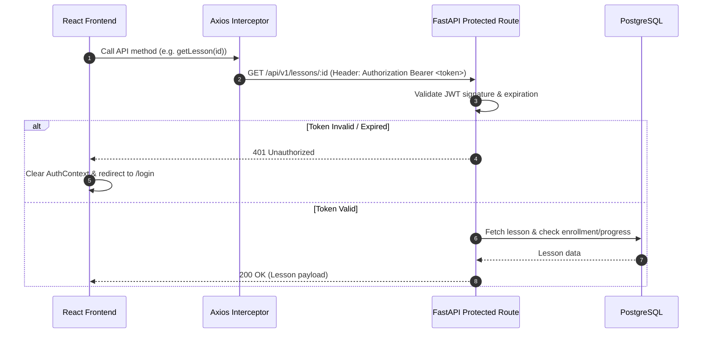
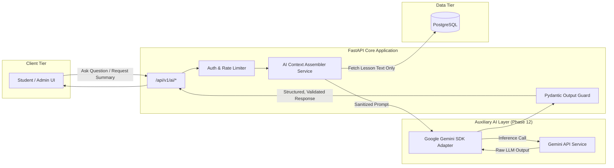

# LITERA — Technical Architecture & System Design

## 1. System Overview & Architecture Principles

LITERA is a modern digital literacy learning platform designed for high-school and university students. The platform employs a clean decoupled client-server architecture:

* **Frontend**: Single Page Application (SPA) built with React 18, Vite, TypeScript, and Tailwind CSS.
* **Backend**: RESTful API service built with Python 3.11+, FastAPI, and SQLAlchemy ORM.
* **Database**: Relational data store using local PostgreSQL 15+.
* **Security Layer**: Stateless JWT authentication with Argon2 password hashing and strict Role-Based Access Control (RBAC).

```mermaid
flowchart TD
    Client["Client Browser (Desktop / Mobile)"]

    subgraph Frontend["Frontend Layer (Vite + React SPA)"]
        UI["UI / Pages / Components"]
        Hooks["Custom Hooks & Context"]
        RQ["TanStack Query (Cache & State)"]
        AxiosClient["Axios HTTP Client (Interceptors)"]
    end

    subgraph Backend["Backend Layer (FastAPI)"]
        Router["API Routers (/api/v1/*)"]
        AuthGuard["Auth & Role Guards (JWT + RBAC)"]
        Pydantic["Pydantic v2 (Input/Output Schemas)"]
        Services["Domain Service Layer (Business Logic)"]
        ORM["SQLAlchemy 2.0 ORM Models"]
    end

    subgraph Database["Persistence Layer (PostgreSQL)"]
        Postgres[("PostgreSQL Database (Local Port 5432)")]
        Alembic["Alembic Migrations"]
    end

    subgraph Auxiliary["Future Layer (Phase 12)"]
        AIService["AI Service Layer (Sandboxed, No direct DB)"]
    end

    Client <-->|HTTPS / JSON| UI
    UI --> Hooks
    Hooks --> RQ
    RQ --> AxiosClient
    AxiosClient <-->|REST API + Bearer JWT| Router
    Router --> AuthGuard
    AuthGuard --> Pydantic
    Pydantic --> Services
    Services --> ORM
    ORM <-->|SQL Queries / Connection Pool| Postgres
    Alembic -.->|Schema Versioning| Postgres
    Services -.->|Phase 12 Only (Structured Context)| AIService
```

### Architectural Invariants
1. **Zero Direct DB Access for Clients**: The client communicates strictly with the FastAPI backend over REST.
2. **Business Logic Isolation**: API route handlers only handle HTTP request parsing, dependency injection, and response serializing. All business rules (quiz scoring, enrollment checks, progress calculation) live in `app/services/`.
3. **Strict AI Isolation**: The core application has zero runtime dependencies on AI. In Phase 12, AI functionality will be implemented as an auxiliary service called by the backend service layer with strictly bounded context.
4. **Platform Independence & Native Windows**: The codebase does not rely on Docker or Linux-specific utilities. All scripts, environment variables, and commands are native Windows friendly.

---

## 2. Frontend Architecture

### 2.1 Technology Stack & Rationale
* **React 18 + Vite**: High-performance development server, fast HMR, and optimized production builds.
* **TypeScript (Strict Mode)**: Type safety across all domain models, API responses, component props, and state.
* **Tailwind CSS**: Utility-first CSS for responsive, accessible, and clean educational UI styling.
* **React Router v6**: Client-side declarative routing with nested layouts and route protection guards.
* **TanStack Query (React Query v5)**: Server state management, automatic caching, background refetching, and mutation handling.
* **Axios**: HTTP client equipped with request interceptors for JWT token injection and response interceptors for global 401 handling.
* **React Hook Form + Zod**: Type-safe form validation matching backend Pydantic schemas.

### 2.2 Directory Structure
```
frontend/src/
├── assets/             # Static images, icons, logos
├── components/
│   ├── ui/             # Reusable base UI (Button, Input, Modal, Card, Badge, Skeleton)
│   ├── layout/         # Navbar, Footer, Sidebar, AdminLayout, StudentLayout
│   ├── course/         # CourseCard, CourseFilter, ModuleAccordion, LessonList
│   ├── lesson/         # LessonViewer, MarkdownRenderer, LessonNavigation
│   ├── quiz/           # QuizCard, QuestionView, OptionSelector, QuizTimer, AttemptSummary
│   ├── discussion/     # DiscussionCard, CommentList, ReplyBox, LikeButton
│   └── common/         # ProtectedRoute, RoleGuard, EmptyState, ErrorBoundary
├── context/
│   └── AuthContext.tsx # User session state, login/logout handlers
├── hooks/
│   ├── useAuth.ts      # AuthContext consumer hook
│   ├── useCourses.ts   # TanStack Query hooks for course operations
│   ├── useQuiz.ts      # Quiz loading, submission, and timer hooks
│   └── useDebounce.ts  # Input debounce for search & filters
├── pages/
│   ├── auth/           # LoginPage, RegisterPage
│   ├── public/         # HomePage, CourseCatalogPage, CourseDetailPage
│   ├── student/        # DashboardPage, LessonPage, QuizPage, QuizResultPage, BookmarksPage, ProfilePage
│   └── admin/          # AdminDashboard, ManageCourses, ManageLessons, ManageQuizzes, ManageUsers
├── routes/
│   └── AppRoutes.tsx   # Route definitions, guards, and fallback 404
├── services/
│   ├── api.ts          # Axios instance configuration and interceptors
│   ├── auth.service.ts
│   ├── course.service.ts
│   ├── quiz.service.ts
│   └── discussion.service.ts
├── types/
│   ├── auth.ts         # User, Role, Token types
│   ├── course.ts       # Course, Module, Lesson, Category types
│   ├── quiz.ts         # Quiz, Question, Option, Attempt types
│   └── api.ts          # PaginatedResponse, ApiError types
└── utils/
    ├── formatters.ts   # Date formatting, duration formatting
    └── storage.ts      # LocalStorage token helpers
```

### 2.3 Route Architecture & Guards


---

## 3. Backend Architecture

### 3.1 Layered Modular Pattern
The backend is structured into distinct layers with unidirectional data flow:
1. **Routers (`app/api/v1/`)**: Define endpoints, parse request parameters, execute dependency injection (database session, current user).
2. **Schemas (`app/schemas/`)**: Pydantic models for request validation and response serialization.
3. **Services (`app/services/`)**: Encapsulate all business rules, orchestration, grading calculations, and permissions logic.
4. **Models (`app/models/`)**: SQLAlchemy declarative models mapping to PostgreSQL tables.
5. **Core (`app/core/`)**: Cross-cutting concerns including security, configuration, exceptions, and authentication dependencies.

```
backend/
├── app/
│   ├── main.py                 # FastAPI application factory, CORS, exception handlers
│   ├── config.py               # Pydantic BaseSettings (loads .env)
│   ├── database.py             # SQLAlchemy engine, sessionmaker, Base class
│   ├── core/
│   │   ├── security.py         # Argon2 hashing, JWT encode/decode
│   │   ├── dependencies.py     # get_db, get_current_user, require_role
│   │   └── exceptions.py       # Custom domain exceptions & HTTP handlers
│   ├── models/                 # SQLAlchemy ORM models
│   │   ├── __init__.py
│   │   ├── user.py
│   │   ├── course.py
│   │   ├── lesson.py
│   │   ├── progress.py
│   │   ├── quiz.py
│   │   ├── discussion.py
│   │   └── achievement.py
│   ├── schemas/                # Pydantic v2 schemas
│   │   ├── user.py
│   │   ├── course.py
│   │   ├── quiz.py
│   │   ├── progress.py
│   │   └── common.py           # Pagination, Generic response envelopes
│   ├── services/               # Core business logic
│   │   ├── auth_service.py
│   │   ├── course_service.py
│   │   ├── progress_service.py
│   │   ├── quiz_service.py
│   │   └── discussion_service.py
│   └── api/
│       └── v1/                 # Versioned API routes
│           ├── __init__.py
│           ├── router.py       # Aggregated v1 API router
│           ├── auth.py
│           ├── users.py
│           ├── categories.py
│           ├── courses.py
│           ├── lessons.py
│           ├── quizzes.py
│           ├── progress.py
│           ├── discussions.py
│           └── admin.py
├── alembic/                    # Database migration scripts
│   ├── versions/
│   └── env.py
├── tests/                      # Unit & integration tests
├── requirements.txt            # Python dependencies
└── .env.example                # Example environment variables
```

---

## 4. Role and Permission Model (RBAC)

LITERA supports two distinct initial roles: `STUDENT` and `ADMIN`.

| Resource / Capability | Public (Guest) | Student | Admin |
| :--- | :---: | :---: | :---: |
| Register & Login | Yes | Yes | Yes |
| Browse & Search Published Courses | Yes | Yes | Yes |
| View Course Outline | Yes | Yes | Yes |
| Enroll in Course & Read Lessons | No | Yes | Yes |
| Track Lesson Progress & Bookmark | No | Yes | Yes |
| Attempt Quizzes & View Results | No | Yes | Yes |
| Create & Like Discussions | No | Yes | Yes |
| Comment on Discussions | No | Yes | Yes |
| Edit/Delete Own Posts & Comments | No | Yes (Own only) | Yes (Any) |
| Manage Categories & Courses | No | No | Yes |
| Manage Modules & Lessons | No | No | Yes |
| Manage Quizzes, Questions & Options | No | No | Yes |
| Manage Users & Moderation | No | No | Yes |
| View System Analytics & Reports | No | No | Yes |

### Dependency Injection Pattern for Authorization
```python
# Conceptual implementation in app/core/dependencies.py
async def get_current_user(token: str = Depends(oauth2_scheme), db: AsyncSession = Depends(get_db)) -> User:
    ...

def require_role(required_role: UserRole):
    def role_checker(current_user: User = Depends(get_current_user)) -> User:
        if current_user.role != required_role and current_user.role != UserRole.ADMIN:
            raise HTTPException(status_code=403, detail="Insufficient permissions")
        return current_user
    return role_checker
```

---

## 5. Authentication Flow

### 5.1 Registration & Login Flow


### 5.2 Authenticated Request Flow


---

## 6. Main Frontend Routes

### Public Routes
* `/`: Platform landing page highlighting features, courses, and educational objectives.
* `/courses`: Public course catalog with category filters and text search.
* `/courses/:slug`: Public course landing page detailing syllabus, modules, and prerequisites.
* `/login`: User login screen with role redirection.
* `/register`: Student registration form with client-side validation.

### Student Routes (Guarded by `requireAuth`)
* `/dashboard`: Student overview (continue learning, course progress, quiz stats, bookmarks).
* `/courses/:slug/learn`: Enrolled course viewer.
* `/lessons/:lessonId`: Lesson study view with content reader, markdown parsing, and completion trigger.
* `/quizzes/:quizId`: Interactive quiz interface with timers, navigation, and submission form.
* `/quiz-results/:attemptId`: Score report, correct answers review, and retake option.
* `/bookmarks`: Personal repository of saved lessons.
* `/discussions`: Community forums with filtering by course/category.
* `/discussions/:discussionId`: Discussion thread with comments and like actions.
* `/profile`: Account settings and achievement showcase.

### Admin Routes (Guarded by `requireRole('ADMIN')`)
* `/admin`: Overview KPI metrics (active students, total courses, completions).
* `/admin/users`: User management table (role assignment, status toggling).
* `/admin/categories`: Category creation and taxonomy management.
* `/admin/courses`: Course catalog management (Draft, Publish, Archive).
* `/admin/courses/create`: Multi-step course creation wizard.
* `/admin/courses/:courseId/edit`: Course metadata and module builder.
* `/admin/modules/:moduleId/lessons`: Lesson content authoring and ordering.
* `/admin/lessons/:lessonId/quiz`: Quiz builder (add questions, set options, specify correct answer).
* `/admin/analytics`: Detailed engagement, quiz pass-rate, and dropout analytics.

---

## 7. Future AI Integration Boundary (Phase 12 Architecture)

LITERA maintains a strict architectural sandbox for AI capabilities to guarantee system reliability, data privacy, and zero core dependency.



### AI Boundary Rules:
1. **No Direct Database Access**: The AI service/model never issues SQL queries or accesses database connection pools.
2. **Context Assembly by Backend**: The backend fetches only the necessary, sanitized content (e.g., current lesson text) to build the prompt.
3. **Structured Outputs**: All AI responses must conform to strict Pydantic schemas (e.g. summaries, recommendations, generated questions).
4. **Human in the Loop**: AI-generated quiz questions or lesson drafts created by admins must enter a `DRAFT` state requiring explicit admin approval before publishing.
5. **Graceful Degradation**: If the external AI service times out or errors, the frontend displays an unobtrusive "Assistant currently unavailable" notification without affecting the lesson or quiz flow.
