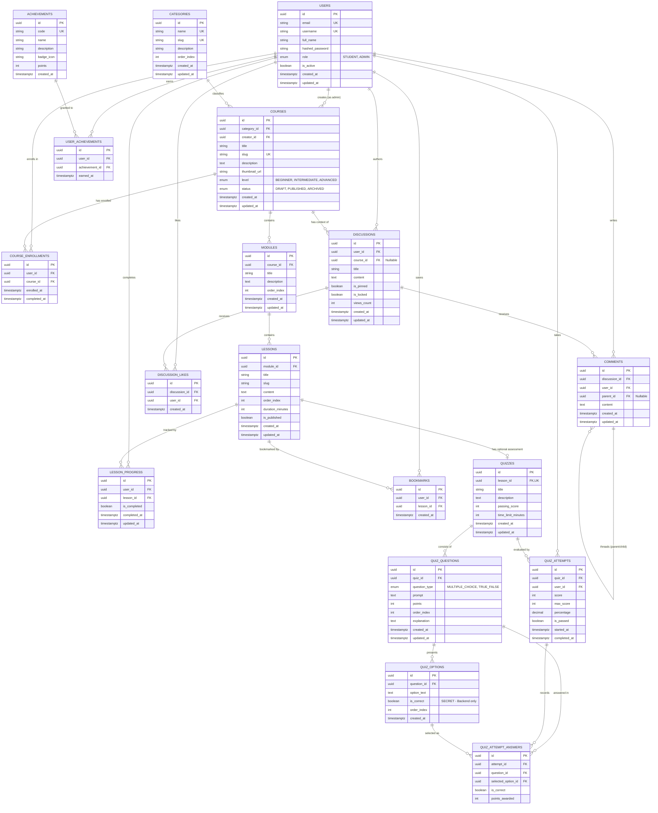

# LITERA — Database Architecture & Entity Relationship Design

## 1. Overview & Database Standards

* **Engine**: PostgreSQL 15+ (Local instance on native Windows, default port 5432).
* **ORM**: SQLAlchemy 2.0 (Declarative Base with modern typed mappings).
* **Migrations**: Alembic (all schema modifications must be version-controlled via migration scripts).
* **Primary Keys**: UUID v4 (`uuid_generate_v4()` or application-level `uuid.uuid4`) to eliminate enumeration vulnerabilities and simplify data synchronization.
* **Timestamps**: All tables track `created_at` (timestamptz, default now()) and `updated_at` (timestamptz, default now(), auto-updated on modification).
* **Data Integrity**: Enforce foreign keys with explicit cascade behaviors (`CASCADE`, `RESTRICT`, or `SET NULL`), unique constraints, and domain checks at the database level.

---

## 2. Entity Relationship Diagram (ERD)

---

## 3. Detailed Table Specifications

### 3.1 `users`
Represents student and administrative accounts.

| Column | Type | Constraints | Description |
| :--- | :--- | :--- | :--- |
| `id` | UUID | PK, default `uuid_generate_v4()` | Unique user identifier |
| `email` | VARCHAR(255) | NOT NULL, UNIQUE, INDEX | Primary login credential |
| `username` | VARCHAR(50) | NOT NULL, UNIQUE, INDEX | Display name and mention handle |
| `full_name` | VARCHAR(150) | NOT NULL | Student/Admin real name |
| `hashed_password` | VARCHAR(255) | NOT NULL | Argon2id secure hash |
| `role` | VARCHAR(20) | NOT NULL, DEFAULT `'STUDENT'` | `STUDENT` or `ADMIN` |
| `is_active` | BOOLEAN | NOT NULL, DEFAULT TRUE | Soft ban / status flag |
| `created_at` | TIMESTAMPTZ | NOT NULL, DEFAULT NOW() | Account creation time |
| `updated_at` | TIMESTAMPTZ | NOT NULL, DEFAULT NOW() | Last update timestamp |

### 3.2 `categories`
Curated educational pillars (Digital Literacy, Information Literacy, AI Literacy, etc.).

| Column | Type | Constraints | Description |
| :--- | :--- | :--- | :--- |
| `id` | UUID | PK | Unique category identifier |
| `name` | VARCHAR(100) | NOT NULL, UNIQUE | Category title |
| `slug` | VARCHAR(100) | NOT NULL, UNIQUE, INDEX | URL-safe identifier |
| `description` | TEXT | NULLABLE | Category summary |
| `order_index` | INTEGER | NOT NULL, DEFAULT 0 | Display sequence order |
| `created_at` | TIMESTAMPTZ | NOT NULL, DEFAULT NOW() | Creation timestamp |
| `updated_at` | TIMESTAMPTZ | NOT NULL, DEFAULT NOW() | Modification timestamp |

### 3.3 `courses`
Curriculum units containing multiple learning modules.

| Column | Type | Constraints | Description |
| :--- | :--- | :--- | :--- |
| `id` | UUID | PK | Course identifier |
| `category_id` | UUID | NOT NULL, FK(`categories.id`, ON DELETE RESTRICT) | Associated taxonomy category |
| `creator_id` | UUID | NOT NULL, FK(`users.id`, ON DELETE RESTRICT) | Admin user who authored course |
| `title` | VARCHAR(200) | NOT NULL | Course title |
| `slug` | VARCHAR(200) | NOT NULL, UNIQUE, INDEX | SEO & URL slug |
| `description` | TEXT | NOT NULL | Comprehensive overview |
| `thumbnail_url`| VARCHAR(500) | NULLABLE | Cover image path / URL |
| `level` | VARCHAR(20) | NOT NULL, DEFAULT `'BEGINNER'` | `BEGINNER`, `INTERMEDIATE`, `ADVANCED` |
| `status` | VARCHAR(20) | NOT NULL, DEFAULT `'DRAFT'` | `DRAFT`, `PUBLISHED`, `ARCHIVED` |
| `created_at` | TIMESTAMPTZ | NOT NULL, DEFAULT NOW() | Creation timestamp |
| `updated_at` | TIMESTAMPTZ | NOT NULL, DEFAULT NOW() | Last update timestamp |

### 3.4 `course_enrollments`
Explicit linkage between students and courses they are actively learning.

| Column | Type | Constraints | Description |
| :--- | :--- | :--- | :--- |
| `id` | UUID | PK | Enrollment identifier |
| `user_id` | UUID | NOT NULL, FK(`users.id`, ON DELETE CASCADE) | Student identifier |
| `course_id` | UUID | NOT NULL, FK(`courses.id`, ON DELETE CASCADE) | Course identifier |
| `enrolled_at` | TIMESTAMPTZ | NOT NULL, DEFAULT NOW() | Date student started course |
| `completed_at`| TIMESTAMPTZ | NULLABLE | Date all lessons completed |

*Constraint*: `UNIQUE(user_id, course_id)` prevents duplicate enrollments.

### 3.5 `modules`
Logical grouping of lessons inside a course.

| Column | Type | Constraints | Description |
| :--- | :--- | :--- | :--- |
| `id` | UUID | PK | Module identifier |
| `course_id` | UUID | NOT NULL, FK(`courses.id`, ON DELETE CASCADE) | Parent course |
| `title` | VARCHAR(200) | NOT NULL | Module title |
| `description` | TEXT | NULLABLE | Module overview |
| `order_index` | INTEGER | NOT NULL | Sequence within course |
| `created_at` | TIMESTAMPTZ | NOT NULL, DEFAULT NOW() | Creation timestamp |
| `updated_at` | TIMESTAMPTZ | NOT NULL, DEFAULT NOW() | Last update timestamp |

*Constraint*: `UNIQUE(course_id, order_index)` guarantees deterministic ordering.

### 3.6 `lessons`
Individual learning unit containing rich educational text/markdown.

| Column | Type | Constraints | Description |
| :--- | :--- | :--- | :--- |
| `id` | UUID | PK | Lesson identifier |
| `module_id` | UUID | NOT NULL, FK(`modules.id`, ON DELETE CASCADE) | Parent module |
| `title` | VARCHAR(200) | NOT NULL | Lesson title |
| `slug` | VARCHAR(200) | NOT NULL | Lesson slug within module |
| `content` | TEXT | NOT NULL | Lesson body (Markdown format) |
| `order_index` | INTEGER | NOT NULL | Sequence within module |
| `duration_minutes` | INTEGER | NOT NULL, DEFAULT 5 | Estimated reading duration |
| `is_published`| BOOLEAN | NOT NULL, DEFAULT TRUE | Visibility flag |
| `created_at` | TIMESTAMPTZ | NOT NULL, DEFAULT NOW() | Creation timestamp |
| `updated_at` | TIMESTAMPTZ | NOT NULL, DEFAULT NOW() | Last update timestamp |

*Constraint*: `UNIQUE(module_id, order_index)`.

### 3.7 `lesson_progress`
Tracks student completion status of individual lessons.

| Column | Type | Constraints | Description |
| :--- | :--- | :--- | :--- |
| `id` | UUID | PK | Progress record ID |
| `user_id` | UUID | NOT NULL, FK(`users.id`, ON DELETE CASCADE) | Student |
| `lesson_id` | UUID | NOT NULL, FK(`lessons.id`, ON DELETE CASCADE) | Target lesson |
| `is_completed`| BOOLEAN | NOT NULL, DEFAULT TRUE | Completion status |
| `completed_at`| TIMESTAMPTZ | NOT NULL, DEFAULT NOW() | Time of completion |
| `updated_at` | TIMESTAMPTZ | NOT NULL, DEFAULT NOW() | Last state change |

*Constraint*: `UNIQUE(user_id, lesson_id)` ensures one progress state per student per lesson.

### 3.8 `bookmarks`
Saved lessons for quick reference by students.

| Column | Type | Constraints | Description |
| :--- | :--- | :--- | :--- |
| `id` | UUID | PK | Bookmark ID |
| `user_id` | UUID | NOT NULL, FK(`users.id`, ON DELETE CASCADE) | Student |
| `lesson_id` | UUID | NOT NULL, FK(`lessons.id`, ON DELETE CASCADE) | Bookmarked lesson |
| `created_at` | TIMESTAMPTZ | NOT NULL, DEFAULT NOW() | Creation time |

*Constraint*: `UNIQUE(user_id, lesson_id)` prevents duplicate bookmarks.

### 3.9 `quizzes`
End-of-lesson knowledge assessment.

| Column | Type | Constraints | Description |
| :--- | :--- | :--- | :--- |
| `id` | UUID | PK | Quiz identifier |
| `lesson_id` | UUID | NOT NULL, UNIQUE, FK(`lessons.id`, ON DELETE CASCADE) | 1-to-1 association with a lesson |
| `title` | VARCHAR(200) | NOT NULL | Quiz title |
| `description` | TEXT | NULLABLE | Instructions for student |
| `passing_score` | INTEGER | NOT NULL, DEFAULT 70 | Percentage threshold to pass (e.g. 70%) |
| `time_limit_minutes` | INTEGER | NULLABLE | Optional countdown limit in minutes |
| `created_at` | TIMESTAMPTZ | NOT NULL, DEFAULT NOW() | Creation timestamp |
| `updated_at` | TIMESTAMPTZ | NOT NULL, DEFAULT NOW() | Last update timestamp |

### 3.10 `quiz_questions`
Questions belonging to a quiz.

| Column | Type | Constraints | Description |
| :--- | :--- | :--- | :--- |
| `id` | UUID | PK | Question identifier |
| `quiz_id` | UUID | NOT NULL, FK(`quizzes.id`, ON DELETE CASCADE) | Parent quiz |
| `question_type` | VARCHAR(30) | NOT NULL | `MULTIPLE_CHOICE` or `TRUE_FALSE` |
| `prompt` | TEXT | NOT NULL | Question text |
| `points` | INTEGER | NOT NULL, DEFAULT 1 | Weight/points awarded for correct answer |
| `order_index` | INTEGER | NOT NULL | Sequence within quiz |
| `explanation` | TEXT | NULLABLE | Rational text shown after grading |
| `created_at` | TIMESTAMPTZ | NOT NULL, DEFAULT NOW() | Creation timestamp |
| `updated_at` | TIMESTAMPTZ | NOT NULL, DEFAULT NOW() | Last update timestamp |

*Constraint*: `UNIQUE(quiz_id, order_index)`.

### 3.11 `quiz_options`
Choices associated with a question.

| Column | Type | Constraints | Description |
| :--- | :--- | :--- | :--- |
| `id` | UUID | PK | Option identifier |
| `question_id` | UUID | NOT NULL, FK(`quiz_questions.id`, ON DELETE CASCADE) | Parent question |
| `option_text` | TEXT | NOT NULL | Text presented to student |
| `is_correct` | BOOLEAN | NOT NULL, DEFAULT FALSE | **CRITICAL SECURITY INVARIANT**: Secret |
| `order_index` | INTEGER | NOT NULL | Sequence among options |
| `created_at` | TIMESTAMPTZ | NOT NULL, DEFAULT NOW() | Creation timestamp |

*Data Integrity Note*: For `TRUE_FALSE` questions, two options ("True" and "False") are created in this table, preserving uniform schema behavior.

### 3.12 `quiz_attempts`
Records an individual test session taken by a student.

| Column | Type | Constraints | Description |
| :--- | :--- | :--- | :--- |
| `id` | UUID | PK | Attempt identifier |
| `quiz_id` | UUID | NOT NULL, FK(`quizzes.id`, ON DELETE CASCADE) | Quiz taken |
| `user_id` | UUID | NOT NULL, FK(`users.id`, ON DELETE CASCADE) | Student taking the quiz |
| `score` | INTEGER | NOT NULL, DEFAULT 0 | Total points earned |
| `max_score` | INTEGER | NOT NULL, DEFAULT 0 | Maximum possible points |
| `percentage` | NUMERIC(5,2) | NOT NULL, DEFAULT 0.00 | Computed score percentage |
| `is_passed` | BOOLEAN | NOT NULL, DEFAULT FALSE | Whether `percentage >= passing_score` |
| `started_at` | TIMESTAMPTZ | NOT NULL, DEFAULT NOW() | Session start time |
| `completed_at`| TIMESTAMPTZ | NULLABLE | Session submission time |

### 3.13 `quiz_attempt_answers`
Granular record of choices made by the student during an attempt.

| Column | Type | Constraints | Description |
| :--- | :--- | :--- | :--- |
| `id` | UUID | PK | Attempt answer ID |
| `attempt_id` | UUID | NOT NULL, FK(`quiz_attempts.id`, ON DELETE CASCADE) | Parent attempt |
| `question_id` | UUID | NOT NULL, FK(`quiz_questions.id`, ON DELETE CASCADE) | Question answered |
| `selected_option_id` | UUID | NULLABLE, FK(`quiz_options.id`, ON DELETE SET NULL) | Option chosen by student |
| `is_correct` | BOOLEAN | NOT NULL, DEFAULT FALSE | Computed correctness at submission |
| `points_awarded` | INTEGER | NOT NULL, DEFAULT 0 | Points granted |

*Constraint*: `UNIQUE(attempt_id, question_id)` guarantees one response per question per attempt.

### 3.14 `discussions`
Community forum topics created by students or admins.

| Column | Type | Constraints | Description |
| :--- | :--- | :--- | :--- |
| `id` | UUID | PK | Discussion identifier |
| `user_id` | UUID | NOT NULL, FK(`users.id`, ON DELETE CASCADE) | Author |
| `course_id` | UUID | NULLABLE, FK(`courses.id`, ON DELETE SET NULL) | Optional course context |
| `title` | VARCHAR(250) | NOT NULL | Discussion headline |
| `content` | TEXT | NOT NULL | Body content |
| `is_pinned` | BOOLEAN | NOT NULL, DEFAULT FALSE | Admin pin to top |
| `is_locked` | BOOLEAN | NOT NULL, DEFAULT FALSE | Disables new comments |
| `views_count` | INTEGER | NOT NULL, DEFAULT 0 | Incremented view count |
| `created_at` | TIMESTAMPTZ | NOT NULL, DEFAULT NOW() | Timestamp |
| `updated_at` | TIMESTAMPTZ | NOT NULL, DEFAULT NOW() | Timestamp |

### 3.15 `comments`
Replies within a discussion thread.

| Column | Type | Constraints | Description |
| :--- | :--- | :--- | :--- |
| `id` | UUID | PK | Comment identifier |
| `discussion_id`| UUID | NOT NULL, FK(`discussions.id`, ON DELETE CASCADE) | Parent discussion |
| `user_id` | UUID | NOT NULL, FK(`users.id`, ON DELETE CASCADE) | Author |
| `parent_id` | UUID | NULLABLE, FK(`comments.id`, ON DELETE CASCADE) | Self-reference for 1-level nested replies |
| `content` | TEXT | NOT NULL | Comment text |
| `created_at` | TIMESTAMPTZ | NOT NULL, DEFAULT NOW() | Creation time |
| `updated_at` | TIMESTAMPTZ | NOT NULL, DEFAULT NOW() | Edit time |

### 3.16 `discussion_likes`
User upvotes on community discussions.

| Column | Type | Constraints | Description |
| :--- | :--- | :--- | :--- |
| `id` | UUID | PK | Like identifier |
| `discussion_id`| UUID | NOT NULL, FK(`discussions.id`, ON DELETE CASCADE) | Target discussion |
| `user_id` | UUID | NOT NULL, FK(`users.id`, ON DELETE CASCADE) | Liking user |
| `created_at` | TIMESTAMPTZ | NOT NULL, DEFAULT NOW() | Timestamp |

*Constraint*: `UNIQUE(discussion_id, user_id)` ensures a user can like a post at most once.

### 3.17 `achievements` & `user_achievements`
Gamification badges awarded for platform milestones.

**`achievements`**:
* `id` (UUID, PK)
* `code` (VARCHAR(50), UNIQUE, NOT NULL, e.g. `'FIRST_LESSON'`, `'QUIZ_ACE'`, `'COMMUNITY_VOICE'`)
* `name` (VARCHAR(100), NOT NULL)
* `description` (TEXT, NOT NULL)
* `badge_icon` (VARCHAR(255), NOT NULL)
* `points` (INTEGER, NOT NULL, DEFAULT 10)
* `created_at` (TIMESTAMPTZ, NOT NULL, DEFAULT NOW())

**`user_achievements`**:
* `id` (UUID, PK)
* `user_id` (UUID, NOT NULL, FK `users.id` ON DELETE CASCADE)
* `achievement_id` (UUID, NOT NULL, FK `achievements.id` ON DELETE CASCADE)
* `earned_at` (TIMESTAMPTZ, NOT NULL, DEFAULT NOW())
* *Constraint*: `UNIQUE(user_id, achievement_id)`.

---

## 4. Performance Indexing Strategy

1. **Slugs & Lookups**:
   * `CREATE UNIQUE INDEX idx_categories_slug ON categories(slug);`
   * `CREATE UNIQUE INDEX idx_courses_slug ON courses(slug);`
   * `CREATE INDEX idx_courses_status_category ON courses(status, category_id);`
2. **Foreign Key Indexes** (Critical for join performance in PostgreSQL):
   * `CREATE INDEX idx_modules_course_id ON modules(course_id);`
   * `CREATE INDEX idx_lessons_module_id ON lessons(module_id);`
   * `CREATE INDEX idx_quiz_questions_quiz_id ON quiz_questions(quiz_id);`
   * `CREATE INDEX idx_quiz_options_question_id ON quiz_options(question_id);`
   * `CREATE INDEX idx_quiz_attempts_user_quiz ON quiz_attempts(user_id, quiz_id);`
   * `CREATE INDEX idx_discussions_course_id ON discussions(course_id);`
   * `CREATE INDEX idx_comments_discussion_id ON comments(discussion_id);`
3. **User Progress & Dashboards**:
   * `CREATE INDEX idx_lesson_progress_user ON lesson_progress(user_id);`
   * `CREATE INDEX idx_course_enrollments_user ON course_enrollments(user_id);`
   * `CREATE INDEX idx_bookmarks_user ON bookmarks(user_id);`
